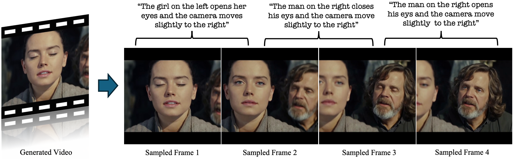

<p align="center">

  <h2 align="center">ByteMorph: Benchmarking Instruction-Guided Image Editing <br> with Non-Rigid Motions</h2>
  <p align="center">
      <a href="https://boese0601.github.io/">Di Chang</a><sup>1,2*</sup>
      ·
      <a href="https://github.com/ljzycmd">Mingdeng Cao</a><sup>1,3*</sup>
    ·  
      <a href="https://seasonsh.github.io/">Yichun Shi</a><sup>1</sup>
    ·  
      <a href="https://www.linkedin.com/in/bo-liu-340313170">Bo Liu</a><sup>1,4</sup>
    ·  
      <a href="https://primecai.github.io/">Shengqu Cai</a><sup>1,5</sup>
    ·  
      <a href="https://shijiezhou-ucla.github.io/">Shijie Zhou</a><sup>6</sup>
    <br>
      <a href="https://scholar.google.com/citations?user=78vU1IUAAAAJ&hl=en">Weilin Huang</a><sup>1</sup>
    · 
      <a href="https://web.stanford.edu/~gordonwz/">Gordon Wetzstein</a><sup>5</sup>
    ·  
      <a href="https://www.ihp-lab.org/">Mohammad Soleymani</a><sup>2</sup>
    ·  
      <a href="https://pengwangucla.github.io/peng-wang.github.io/">Peng Wang</a><sup>1</sup>
    <br>
    <sup>1</sup>ByteDance Seed &nbsp;<sup>2</sup>Unviersity of Southern California &nbsp; <sup>3</sup>University of Tokyo &nbsp; 
    <br>
    <sup>4</sup>University of California Berkeley&nbsp; <sup>5</sup>Stanford University&nbsp; <sup>6</sup>University of California Los Angeles
    <br>
    <br>
    <sup>*</sup> denotes equal contribution
    <br>
    </br>
        <a href='https://huggingface.co/datasets/ByteDance-Seed/BM-Bench'>
        </a>
        <a href='https://huggingface.co/datasets/ByteDance-Seed/BM-6M-Demo'>
        </a>
        <a href='https://huggingface.co/datasets/ByteDance-Seed/BM-6M'>
        </a>
        <a href='https://huggingface.co/ByteDance-Seed/BM-Model'>
        </a>
        <a href='https://huggingface.co/spaces/Boese0601/ByteMorpher-Demo'>
        </a>
        <a href="https://boese0601.github.io/bytemorph/" target="_blank">
        </a>
     </br>
</p>


<p align="center">
  
</p>

This repo is the official pytorch implementation of ByteMorph, include training, inference and evaluation. 

## 📢 News

- **June 03, 2025:** We released the official [website](https://boese0601.github.io/bytemorph/), [dataset](https://huggingface.co/datasets/ByteDance-Seed/BM-6M), [benchmark](https://huggingface.co/datasets/ByteDance-Seed/BM-Bench), [online-demo](https://huggingface.co/spaces/Boese0601/ByteMorph-Demo), and [paper]() for ByteMorph.


## 📜 Requirements
* An NVIDIA GPU with CUDA support is required for inference. 
  * We have tested on a single A100 and H100 GPU.
  * In our experiment, we used CUDA 12.4.
  * Feel free to visit [Flux.1-dev](https://github.com/black-forest-labs/flux) for further details on environment.

## 🛠️ Dependencies and Installation

Clone the repository:
```shell
git clone https://github.com/Boese0601/ByteMorph
cd ByteMorph
```

### Installation Guide

We provide an `requirements.txt` file for setting up the environment.

Run the following command on your terminal:
```shell
# 1. Prepare conda environment
conda create -n bytemorph python=3.10

# 2. Activate the environment
conda activate bytemorph

# 3. Install dependencies
bash env_install.sh

```

## 🧱 Download Pretrained Models
We follow the implementation details in our paper and release pretrained weights of the Diffusion Transformer in [this huggingface repository](https://huggingface.co/Boese0601/ByteMorpher). After downloading, please put it under the [pretrained_weights](pretrained_weights/) folder. 

The Flux.1-dev VAE and DiT can be found [here](https://huggingface.co/black-forest-labs/FLUX.1-dev). The Google-T5 encoder can be found [here](https://huggingface.co/XLabs-AI/xflux_text_encoders). The CLIP encoder can be found [here](https://huggingface.co/openai/clip-vit-large-patch14).

Please place them under [./pretrained_weights/](pretrained_weights/).

Your file structure should look like this:

```bash
ByteMorph
|----...
|----pretrained_weights
  |----models--black-forest-labs--FLUX.1-dev
    |----flux1-dev.safetensors
    |----ae.safetensors
    |----...
  |----models--xlabs-ai--xflux
    |----...
  |----models--openai--clip-vit-large-patch14 
    |----...
  |----ByteMorpher
    |----dit.safetensors
|----...
``` 

## Train and Inference

### Using Command Line

```bash
cd ByteMorph
# Train
bash scripts/train/train.sh

# Inference
bash scripts/test/inference.sh
```

The config files for trainig and inference can be found in [this file](train_configs/train.yaml) and [this file](inference_configs/inference.yaml). 

The DeepSpeed config file for training is [here](train_configs/deepspeed_stage2.yaml).

## Evaluation
Please visit [this page](./ByteMorph-Eval/).

## 🔗 BibTeX Citation
If you find [ByteMorph]() useful for your research and applications, please cite ByteMorph using this BibTeX:

```BibTeX
```


## License
This code is distributed under the FLUX.1-dev Non-Commercial License. See `LICENSE.txt` file for more information.

## Acknowledgement
We would like to thank the contributors to the [Flux.1-dev](https://huggingface.co/black-forest-labs/FLUX.1-dev), [x-flux](https://github.com/XLabs-AI/x-flux), [OminiControl](https://github.com/Yuanshi9815/OminiControl), for their open-source research.

## Disclaimer
Your access to and use of this dataset are at your own risk. We do not guarantee the accuracy of this dataset. The dataset is provided “as is” and we make no warranty or representation to you with respect to it and we expressly disclaim, and hereby expressly waive, all warranties, express, implied, statutory or otherwise. This includes, without limitation, warranties of quality, performance, merchantability or fitness for a particular purpose, non-infringement, absence of latent or other defects, accuracy, or the presence or absence of errors, whether or not known or discoverable. In no event will we be liable to you on any legal theory (including, without limitation, negligence) or otherwise for any direct, special, indirect, incidental, consequential, punitive, exemplary, or other losses, costs, expenses, or damages arising out of this public license or use of the licensed material.The disclaimer of warranties and limitation of liability provided above shall be interpreted in a manner that, to the extent possible, most closely approximates an absolute disclaimer and waiver of all liability.

